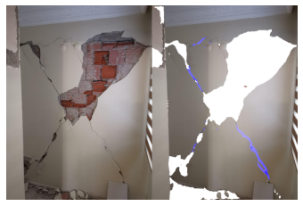

# Identifying Structural Damages with Image Segmentation



This notebook was created for use in [Anadolu Sigorta Datathon](https://www.kaggle.com/c/datathon-challenge-final-round/leaderboard). The competition awarded the solution with fourth place on the basis of the score, and the third place when evaluated together with the presentations.
  
 ## Solution Pipeline
- Image Augmentation
- Customizing weights for class-imbalance
- Pre-trained backbone (DeepLabV3+)
- Pre-training on minority classes
- Full-training with 3 seperate model on full-data
- Blended prediction

## Running the Whole Process
You can run the notebook file to execute full process.

# Please cite this repository when using the content:
```latex
@misc{ozturk2020_anadoludatathon,
author = {Ozturk, Anil and Gunel, Mustafa Burak},
title = {Identifying Structural Damages with Image Segmentation},
year = {2020},
publisher = {GitHub},
journal = {GitHub repository},
howpublished = {\url{https://github.com/nlztrk/kaggle_identifying_structural_damages}},
}